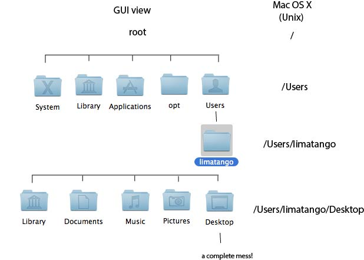

## Introduction to Numerical Methods 

Instructor: Dave May, dmay@ucsd.edu


### Computers in Science

Computers are essential to all modern scientific research. We use them for compiling and analyzing data, preparing illustrations like maps or data plots, writing  manuscripts, and computation. In this class, you will learn to write computer programs solve mathematical problems. We will learn Python, an object-oriented programming language, and use Jupyter notebooks to write our Python programs.

### Python

#### Why learn Python?

- Easier to learn than many other languages.
- Extremely flexible and versatile.
- Freely available and cross platform (works any system).
- It is well supported, actively developed and has lots of online documentation.
- It can help you improve how you conduct your science (currently), and enable new scientific enterprises to begin.
- Python programmers are in demand.


#### Which Python?  
The Python code you will learn to write, and the Python tools you will use during this course are compatible with Python 3.6+.


#### Jupyter notebooks

We will also learn to use Python within [Jupyter notebooks](https://jupyter-notebook-beginner-guide.readthedocs.io/en/latest/what_is_jupyter.html). A Jupyter notebook is a development environment where you can write, debug, and execute your Python programs. It allows you to create documents that contain live code, equations, visualizations and narrative text. 


## Lecture 1

### Learning objectives

- Understand your computers file system.
- Navigating the file system.
- How to create a directory.
- Copying and moving files around.
- Deleting files and directories.  


###  1. The file system

The organization of computers is based on a _file system_. The file system is hierarchical, so at the top you'll find the root _directory_ (on Apple and Windows the term _folder_ is preferred). The root directory contains files and other directories which may also contain files and directories, etc. This continues, resulting in a tree of files and directories that make up the file system. 

Please note that _directory_ means the same thing as _folder_. It is just that in a graphical operating system with icons (left image), the term _folder_ makes sense - they look like folders. Whereas to the operating system, they are traditionally referred to as _directories_.


The following figure is an example of a computer's file system:

    

<!--
    
-->

You are probably familiar with the images like those shown on the left hand side. The text to the right shows the exact same thing - but from your computer's viewpoint. The text on the right identifies directories (and files - not shown here) within the file system hierarchical.
<!--
Specifically, the root directory is identified with `/`. The directory `Users` is hierarchically located _beneath_ the root directory, so 
-->
The symbol `/` can be thought of notation to describe descending down the hierarchcy.
The root directory does not have a name. The directory `Users` is hierarchically located _beneath_ the root directory, hence it is located by descending _down_ from root, hence it's identified as `/Users`. `limatango` is beneath `/Users`, we need to descend again giving as `/Users/limatango`. `/Users` and `/Users/limatango` are examples of a _path_ within the file system. Literarlly, the term "path" means the "way we walk through the file system to access X", where X could be a directory or a file. `/Users/limatango/Desktop` gives us the path to `Desktop` (i.e. the way to access `Desktop`).

We have described the notation to describing descending through the hieararchy, how do we ascend up through the hieararchy? Using the notation `/..`. Hence if `/` means "move down" then `/..` means "move up". For example, the path identified by  `/Users/limatango/Desktop/..` says: starting at root, go down to `Users`, then go down to `limatango`, then go down to `Desktop`, then go up a directory. Hence `/Users/limatango/Desktop/..` is the same path as `/Users/limatango`

One lat piece of nomenclecture, the term _sub-directory_ refers a directory living beneath another directory. Hence the sub-directories of `limatango` are `Library`, `Documents`, `Music`, `Pictures`, `Desktop`.
If one was asked to create a sub-directory of `limatango` called `codes`, we would be referring to the path `/Users/limatango/codes` (this directory is not shown in the figure above).

#### 1.1 Viewing the path

Whether you want to see the path to a file or a directory, the following approaches can be used.

* On Apple (via `Finder`)
	- Select the file (or directory).
	- From the Finder menu, click `File` and select `Get Info`.
	- The path is displayed next to the text `Where:`.
* On Windows (via `Explorer`)
	- Select the file (or directory).
	- Hold down the Shift key and right-click. Select Properties.


### 2. Manipulating the file system

Navigating through the file system is typically performed using applications such as `Finder` (Apple), or `File Explorer` (previously known as `Windows Explorer`) (Windows). 

It is good practice to NEVER use spaces within your directory or files names. 
If you have two words that you wish to use together as a directory name, for example "my" and "work", use the style `MyWork`, or `my_work`. Do not name your directory `My Work`.

* On Apple (via `Finder`)
	1. Create a directory
		- Navigate to where you wish to create your directory.
		- From the Finder menu, click `File` and select `New Folder`.
		- Enter the name of the new directory.
	2. Delete a directory
		- Select the directory you wish to remove. From the Finder menu, click `File` and select `Move to Trash`.
* On Windows (via `Explorer`)
	1. Create a directory
		- Navigate to where you wish to create your directory.
		- Select `New` (top right) and then select `Folder`.
		- Enter the name of the new directory.
	2. Delete a directory
		- Select the directory you wish to remove. Select the trash bin icon.

### 3. Organizing your work for this coarse

Now that we understand what the file system is and how to manipulate it, we will create a collection of directories to store the work we download and create in this course. Organization is the key.

In the `Documents` directory (or similar), create a directory called `numerical_methods_2025`. 
All work related to this course will be contained within this directory.
Please create the following (initial) directory structure within the `Documents` directory:

```
numerical_methods_2025/
numerical_methods_2025/day_1
numerical_methods_2025/day_2
numerical_methods_2025/day_3
numerical_methods_2025/day_4
numerical_methods_2025/day_5
```

This document and all other lecture material discussed today should be downloaded and copied into the directory `numerical_methods_2025/day_1 `.

Any work you perform in the context of exercises (problem sets) should go into the directory called `numerical_methods_2025/numerical_methods_2025/problem_set_N`, where `N` should be replaced with the appropriate problem set number.

Work for problem set 1 should be contained in `numerical_methods_2025/problem_set_1`. Your work for problem set 2 should be contained with `numerical_methods_2025/problem_set_2`, etc. 


### 4. Submitting work
* When submitting homework I want to see: 
  1. any math you were required to write down (photos, scans are fine). If you use a photo or a scan, please rename the file so it is clear which question it relates to;
  2. any code you had to write;
  3. any plots / figures your were asked to create.

* Answers to each coding question should be contained in their own python file. One `.py` file per question. Filenames of your `.py` files must clearly indicate which question they relate to.

* Material you are submitting to be graded should be put in a single directory with the following name

```
YOUR_NAME_problem_set_N
```

where `N` is chosen based on the specific problem set.

* You will need to upload a single file. A directory containing a single or multiple files can be packed into a single file by "zipping" it. To zip a directory, 
	* On Apple (via `Finder`): Select the directory. From the Finder menu, click `File` and select `Compress`. If you zip a directory called `homework_1`, a file called `homework_1.zip` will be created in the same location. You should upload `homework_1.zip` to Canvas.
	* On Windows (via `Explorer`): Right click on the directory. Select `Send to,` and then click `Compressed (Zipped) Folder.` You will be asked to entire the name of the zip file - choose the directory name with `.zip` appended at the end.


## Practice
1. Make sure you know how to use `Finder` or `File Explorer` to navigate the file system on your computer. 
2. Use the content from Section 1.1 to examine the path to a file located in your `Documents` directory.
3. Use the file system navigation application to create the directory structure described in Section 3 with the `Documents` directory.
4. Practice zipping a directory.